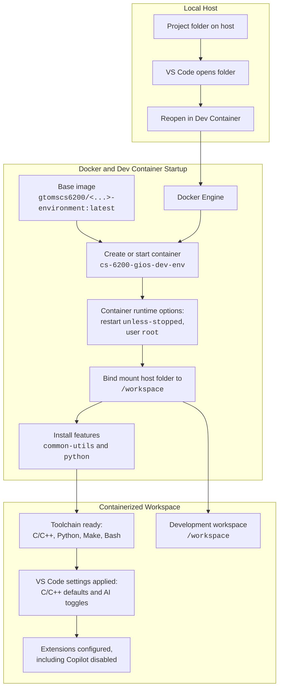

# GIOS Projects Dev Container Workspace

## Development Environment Launch Flow

```mermaid
flowchart TD
    subgraph Host[Local Host]
        H1[Project folder on host]
        H2[VS Code opens folder]
        H3[Reopen in Dev Container]
    end

    subgraph Startup[Docker and Dev Container Startup]
        D1[Docker Engine]
        D2[Create or start container<br/><code>cs-6200-gios-dev-env</code>]
        D3[Base image<br/><code>gtomscs6200/<...>-environment:latest</code>]
        D4[Container runtime options:<br/>restart <code>unless-stopped</code>,<br/>user <code>root</code>]
        D5[Bind mount host folder to<br/><code>/workspace</code>]
        D6[Install features<br/><code>common-utils</code> and <code>python</code>]
    end

    subgraph Workspace[Containerized Workspace]
        W1[Toolchain ready:<br/>C/C++, Python, Make, Bash]
        W2[VS Code settings applied:<br/>C/C++ defaults and AI toggles]
        W3[Extensions configured,<br/>including Copilot disabled]
        W4[Development workspace<br/><code>/workspace</code>]
    end

    H1 --> H2 --> H3 --> D1
    D3 --> D2
    D1 --> D2 --> D4 --> D5 --> D6 --> W1
    D5 --> W4
    W1 --> W2 --> W3
```
